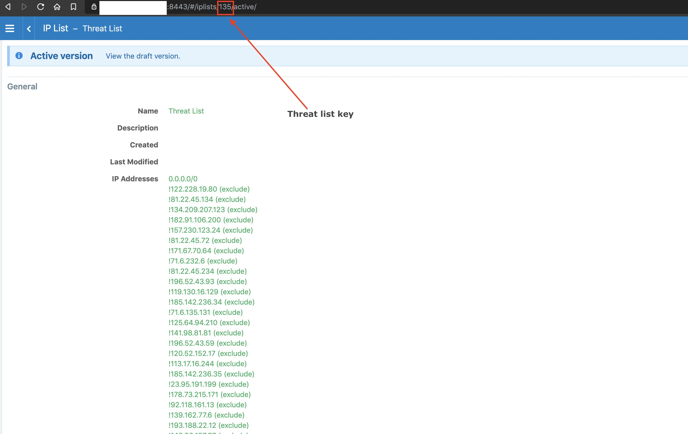

README file for Illumio Guard Duty Integration

1. Navigate to AWS Lambda service and click Create the new function button on the top right corner
1. Choose the option to Author from scratch
1. Give the Function Name as Illumio-Guard-Duty-Shield
1. Choose the Runtime as Python3.6
1. For the Execution role, select Create a new role with Basic Lambda permissions and then hit Create Function Button at the bottom right
1. The Lambda function is created. Before we proceed, we need to go to CloudWatch service in order to create the CloudWatch Events trigger for the Lambda function
1. On the CloudWatch Events page, Click Rules in the left side pane and then click Create Rule.
1. In the Event source, Select Service Name as GuardDuty from the drop down menu
1. In the Event type, select the All Events from the Drop down menu
1. On the right side, click Add Target and then Select Lambda Function from the drop down menu
1. In the Function field, select Illumio-Guard-Duty-Shield from the drop down menu and then click configure details button on the right side.
1. On the next page, Give the name for the rule as IllumioGuardDutyRule and also add a description for the same and then click Create Rule on the right side.
1. Now, we will go to the AWS Lambda function Illumio-Guard-Duty-Shield and add CloudWatch Events from the right hand side as a Trigger
1. This will open up a Rule field where we will select the IllumioGuardDutyRule from the drop down menu and click the Add button
1. Now, We will click on the Illumio-Guard-Duty-Shield with Lambda icon above the Layers and that will open up the function code editor
1. In this editor, copy the code from the lambda_function.py file in this repo and paste it in the editor window
1. Now, Scroll below and in the Environment variables section, add the following keys and their corresponding values based on your Illumio environment:
   1. ILLUMIO_SERVER - Value should be the Illumio PCE URL without any https
   1. ILO_API_KEY_ID - The API key id for the Lambda function to use
   1. ILO_API_KEY_SECRET - The API key secret for the Lambda function to use
   1. ILO_API_VERSION - Version of Illumio API
   1. ILO_ORG_ID - Illumio PCE Org ID to be utilized for this deployment
   1. ILO_PORT - Illumio PCE port for the Lambda to communicate for the API calls
   1. THREAT_LIST_KEY - Numerical Id for the IP list to be updated on the PCE
1. The threat list key for a iplist can be obtained from the PCE as shown in the following image:
   
1. Scroll to the end of the Lambda function page to the Concurrency setting, Set Reserve Concurrency to 1 and then hit Save button at the top Right corner to Save the Lambda function
1. This completes the configuration and creation of the Lambda function on the AWS portal
1. You can now monitor the CloudWatch Log stream to see the logs generate at the time of function execution
