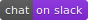

# Illumio Guard Duty Shield

**Project Description**

This repo provides an AWS Lambda function designed to monitor
AWS GuardDuty for malicious IPs, and import them into an Illumio PCE IP list.
This allows Illumio customers to prevent malicious IPs and domains from accessing
AWS-hosted applications by using threat intel from GuardDuty findings to
complement Illumio policy rules.

**Project Technology stack**

The application is written for Python 3 and tested up to v3.9; it is designed to be run as an AWS Lambda function as a container or loaded into the Python runtime.
For more details on packaging Lambda functions please visit https://docs.aws.amazon.com/lambda/latest/dg/lambda-functions.html

**Project workflow**

## Installation

Detailed instructions on how to deploy the Lambda container are located
in the [INSTALL](INSTALL.md) document.

## Support

The AWS Lambda container is released and distributed as open source software subject to the
[LICENSE](LICENSE). Illumio has no obligation or responsibility related to the AWS Lambda
container with respect to support, maintenance, availability, security or otherwise. Please
read the entire [LICENSE](LICENSE) for additional information regarding the permissions and
limitations. You can engage with the author & contributors team and community on SLACK.

## Help or Docs

You can visit us at https://labs.illumio.com
If you have questions, please use slack or email to contact us directly.
If you have issues, bug reports, etc, please file an issue in this repository's Issue Tracker.

## Contributing

Instructions on how to contribute:  [CONTRIBUTING](CONTRIBUTING.md).

## Links

 * Illumio documentation page for configuring Illumio ASP https://support.illumio.com/public/documentation/index.html
